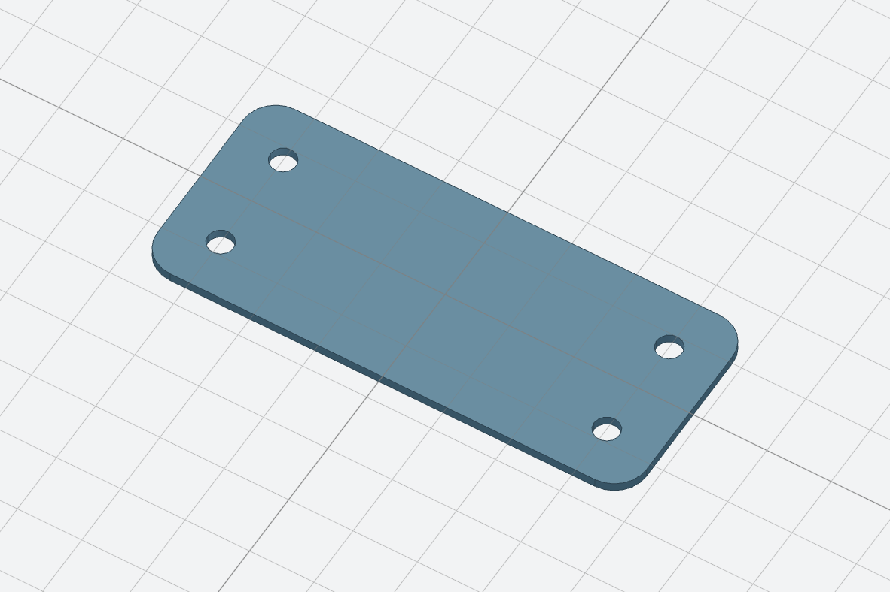
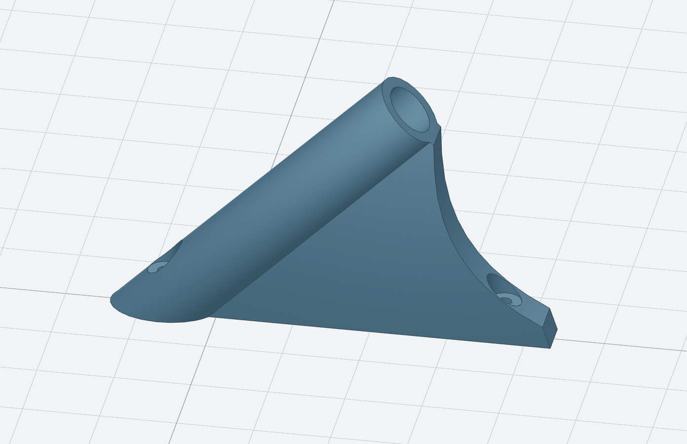

# 3D CAD models

Random parametric 3D models I created.

|Name|Format|Preview|Source code|Edit|
|-|-|-|-|-|
|Axidraw pen holder|OpenSCAD||[axidraw-pen-holder.scad](./axidraw-pen-holder/axidraw-pen-holder.scad)|
|Spring loaded pen holder for plotters|replicad||[spring-loaded-pen-holder.js](./spring-loaded-pen-holder/spring-loaded-pen-holder.js)|[Edit](https://studio.replicad.xyz/workbench?from-url=https://raw.githubusercontent.com/Stanko/3d-cad-models/dev/spring-loaded-pen-holder/spring-loaded-pen-holder.js)|
|Window handle washer|replicad||[window-handle-washer.js](./window-handle-washer/window-handle-washer.js)|[Edit](https://studio.replicad.xyz/workbench?from-url=https://raw.githubusercontent.com/Stanko/3d-cad-models/dev/window-handle-washer/window-handle-washer.js)|
|Sundial gnomon (WIP)|replicad||[sundial-gnomon.js](./sundial-gnomon/sundial-gnomon.js)|[Edit](https://studio.replicad.xyz/workbench?from-url=https://raw.githubusercontent.com/Stanko/3d-cad-models/dev/sundial-gnomon/sundial-gnomon.js)|