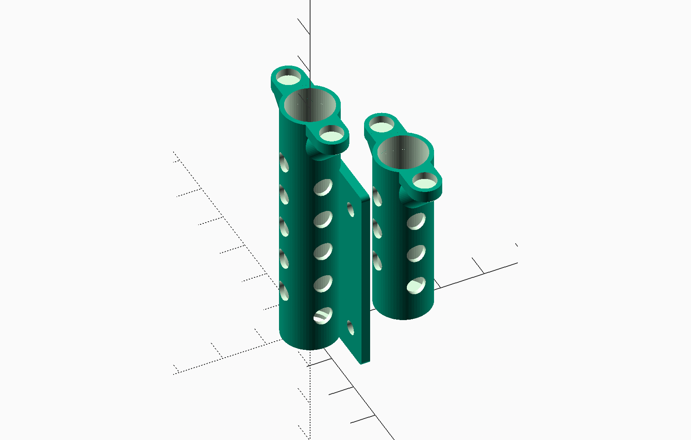
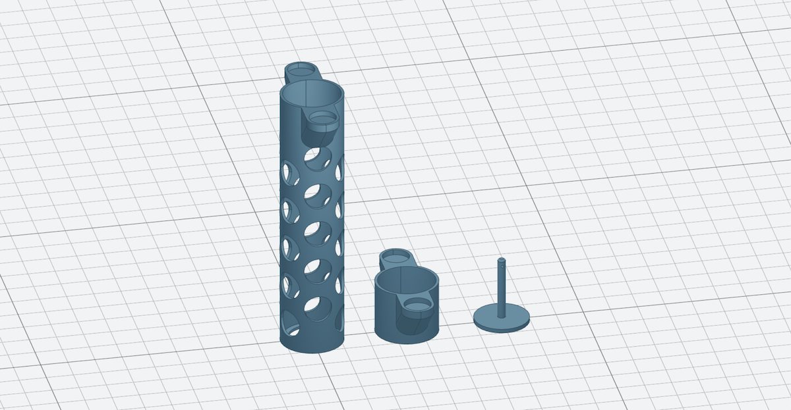
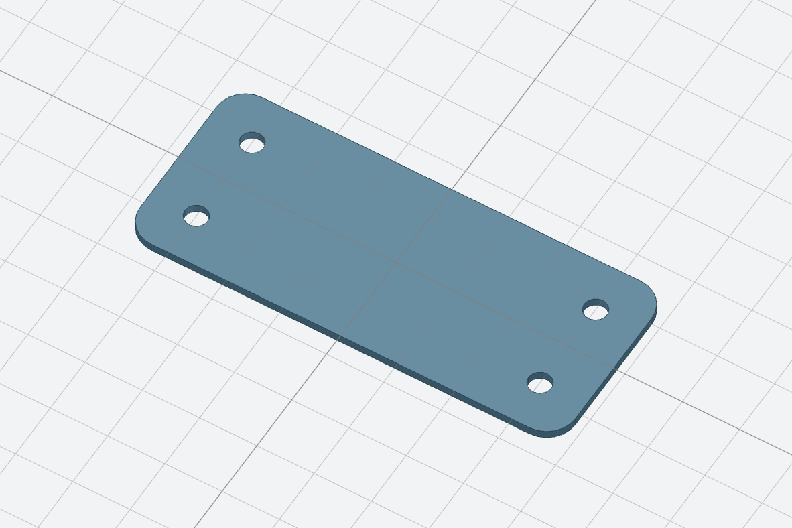
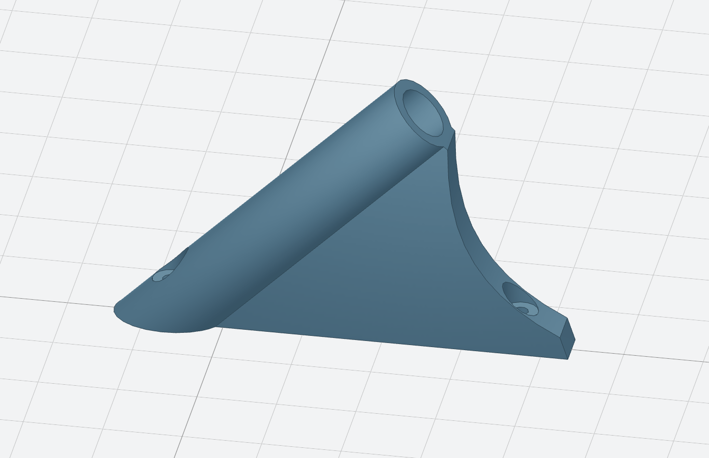
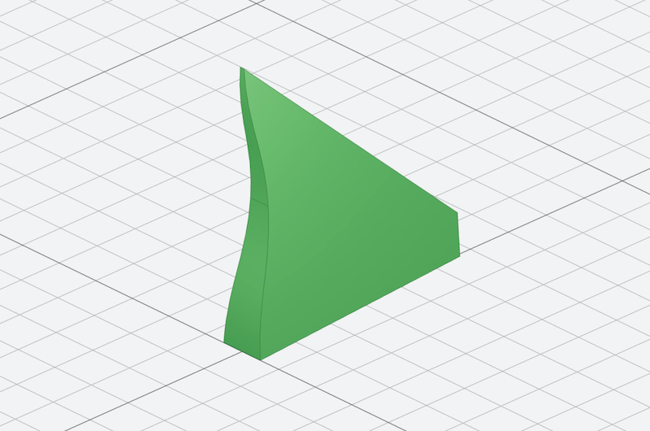
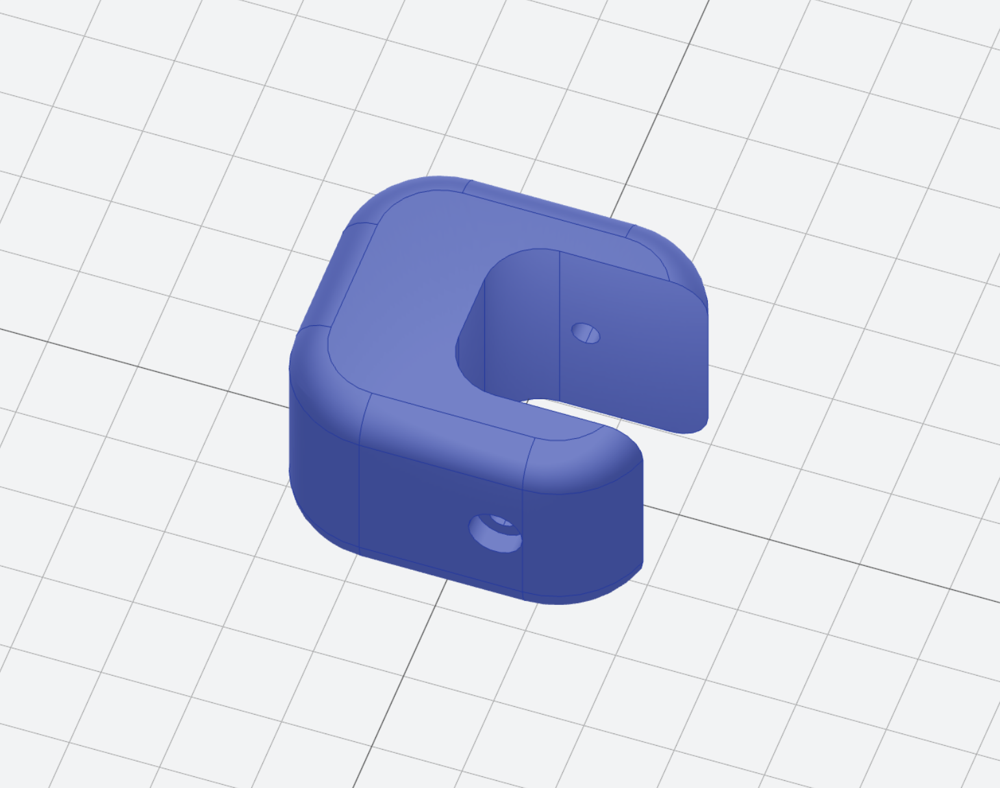
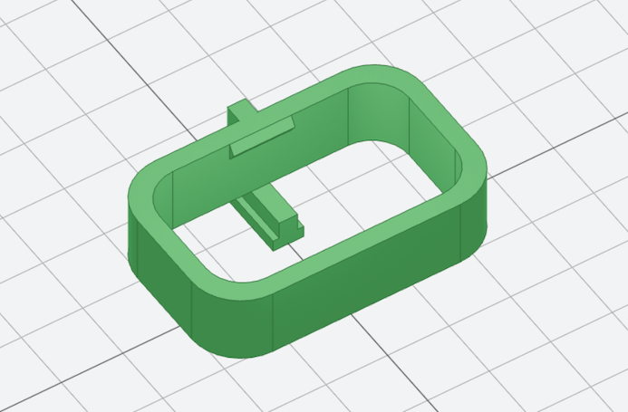
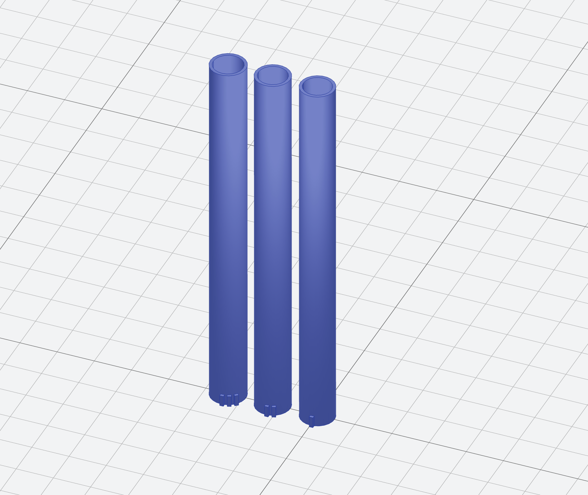

# 3D CAD models

Random parametric 3D models I created.

|Name|Format|Preview|Source code|Edit|
|-|-|-|-|-|
|Axidraw pen holder|OpenSCAD||[axidraw-pen-holder.scad](./axidraw-pen-holder/axidraw-pen-holder.scad)|
|Spring loaded pen holder for plotters|replicad||[spring-loaded-pen-holder.js](./spring-loaded-pen-holder/spring-loaded-pen-holder.js)|[Edit](https://studio.replicad.xyz/workbench?from-url=https://raw.githubusercontent.com/Stanko/3d-cad-models/dev/spring-loaded-pen-holder/spring-loaded-pen-holder.js)|
|Window handle washer|replicad||[window-handle-washer.js](./window-handle-washer/window-handle-washer.js)|[Edit](https://studio.replicad.xyz/workbench?from-url=https://raw.githubusercontent.com/Stanko/3d-cad-models/dev/window-handle-washer/window-handle-washer.js)|
|Sundial gnomon|replicad||[sundial-gnomon.js](./sundial-gnomon/sundial-gnomon.js)|[Edit](https://studio.replicad.xyz/workbench?from-url=https://raw.githubusercontent.com/Stanko/3d-cad-models/dev/sundial-gnomon/sundial-gnomon.js)|
|Sundial gnomon (prism version)|replicad||[sundial-gnomon-prism.js](./sundial-gnomon/sundial-gnomon-prism.js)|[Edit](https://studio.replicad.xyz/workbench?from-url=https://raw.githubusercontent.com/Stanko/3d-cad-models/dev/sundial-gnomon/sundial-gnomon-prism.js)|
|Hacky fix for uneven wooden leg|replicad||[uneven-wooden-leg-fix.js](./uneven-wooden-leg-fix/uneven-wooden-leg-fix.js)|[Edit](https://studio.replicad.xyz/workbench?from-url=https://raw.githubusercontent.com/Stanko/3d-cad-models/dev/uneven-wooden-leg-fix/uneven-wooden-leg-fix.js)|
|GaN charger EU plug lock|replicad||[gan-charger-eu-plug-lock.js](./gan-charger-eu-plug-lock/gan-charger-eu-plug-lock.js)|[Edit](https://studio.replicad.xyz/workbench?from-url=https://raw.githubusercontent.com/Stanko/3d-cad-models/dev/gan-charger-eu-plug-lock/gan-charger-eu-plug-lock.js)|
|Isograph ink reservoir|replicad||[isograph-ink-reservoir.js](./isograph-ink-reservoir/isograph-ink-reservoir.js)|[Edit](https://studio.replicad.xyz/workbench?from-url=https://raw.githubusercontent.com/Stanko/3d-cad-models/dev/isograph-ink-reservoir/isograph-ink-reservoir.js)|
