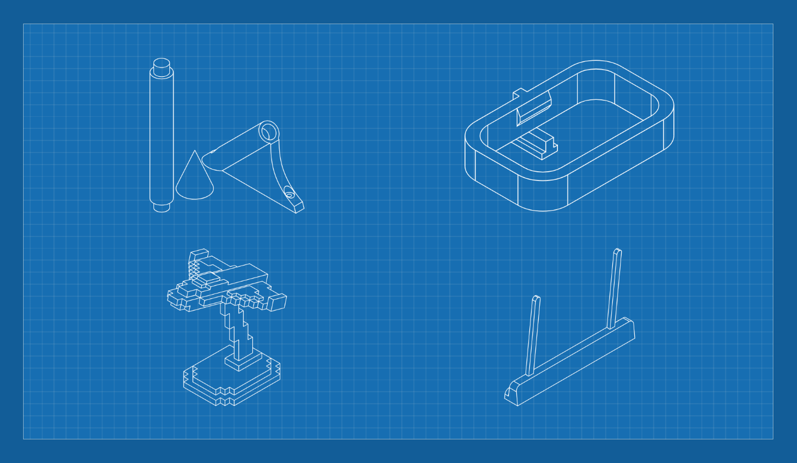

# Parametric 3D Models

A collection of parametric 3D models I've made with Replicad for personal projects. All created in JavaScript (with one SCAD exception). Feel free to use and edit them in any way you like. 

Check them on the website [muffinman.io/3d-models/](https://muffinman.io/3d-models/)

